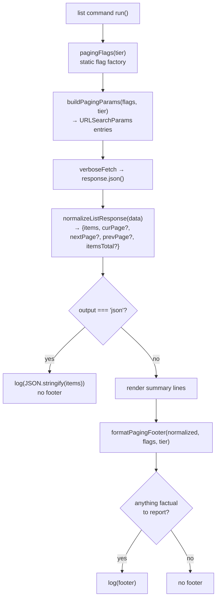

# feat: Uniform `--page`/`--per_page` paging across list commands

## Summary

Add consistent `--page` and `--per_page` flags to every `xano ... list` command whose Metadata API endpoint returns enough information to report paging state honestly, and print a paging footer so the user knows where they are in the result set.

The Metadata API in `~/git/cloud-client` was audited endpoint-by-endpoint. **Paging support is real but uneven** — four distinct tiers exist. Per the scoping decisions, the footer states **only facts the response actually carries**, and endpoints that page without returning any paging metadata are **left alone entirely** rather than given flags whose position the CLI cannot describe.

Net: 11 commands gain or keep working paging flags with a footer, 6 gain a total-count line, and 6 are deliberately untouched.

---

## Problem Frame

Today paging in the CLI is accidental:

- 6 of 23 list commands expose `--page`/`--per_page`; the rest silently use server defaults (25 or 50 items) and truncate results with no indication that truncation happened.
- `tenant/backup list` exposes `--page` but no `--per_page` — with no explanation that the server hardcodes 25.
- **No list command anywhere prints paging state.** Commands that receive a `{curPage, nextPage, prevPage, items[]}` envelope from the API unwrap it, throw the metadata away, and print only `items`. A user running `xano function list` on a workspace with 200 functions sees 50 and has no signal that 150 are missing.

The result is silent data loss at the CLI surface.

---

## API Research Findings (the load-bearing constraint)

Audited every endpoint the CLI's list commands call, in `extensions/MVP/includes/xano/app/workspace/mvp/app/meta/*.yaml` of the `cloud-client` repo. **Endpoints fall into three tiers.**

### Tier A — Pages, and returns paging metadata

Response envelope: `{curPage, nextPage, prevPage, items[]}`. `nextPage`/`prevPage` are server-computed truth (`null` when absent). Produced by the `mvp:meta_get_all` and `mvp:meta_unit_test_get_all` statements (`extensions/MVP/includes/xano/xs/statement/mvp/meta/GetAll.php`, `UnitTestGetAll.php` in `cloud-client`).

| CLI command | Endpoint | `page` | `per_page` |
|---|---|---|---|
| `function list` | `workspace/{id}/function` | ✅ | ✅ max 10000 |
| `unit_test list` | `workspace/{id}/unit_test` | ✅ | ✅ max 10000 |
| `workflow_test list` | `workspace/{id}/workflow_test` | ✅ | ✅ max 10000 |
| `sandbox unit_test list` | `sandbox/unit_test` | ✅ | ✅ max 10000 |
| `sandbox workflow_test list` | `sandbox/workflow_test` | ✅ | ✅ max 10000 |
| `tenant unit_test list` | `workspace/{id}/tenant/{name}/unit_test` | ✅ | ✅ max 10000 |
| `tenant workflow_test list` | `workspace/{id}/tenant/{name}/workflow_test` | ✅ | ✅ max 10000 |

### Tier B — Pages, but returns a bare array (no metadata) — **EXCLUDED, see KTD1a**

These endpoints declare `return: {type: list}` with `totals: false` in their `dbo_view` statement, so the response is a plain JSON array. The requested page number and the returned item count are known; **nothing else is**. These commands are deliberately left untouched by this plan.

| CLI command | Endpoint | `page` | `per_page` |
|---|---|---|---|
| `tenant list` | `workspace/{id}/tenant` | ✅ | ✅ max 100 |
| `release list` | `workspace/{id}/release` | ✅ | ✅ max 100 |
| `platform list` | `platform` | ✅ | ✅ max 100 |
| `tenant cluster list` | `tenant/cluster` | ✅ | ✅ max 100 |
| `ephemeral list` | `ephemeral` / `workspace/{id}/ephemeral` | ✅ | ✅ max 100 |
| `tenant backup list` | `workspace/{id}/tenant/{name}/backup` | ✅ | ❌ server-fixed at 25 |

### Tier B2 — `page` only, envelope returned

The `static_host` family runs `dbo_view` with `per_page` hardcoded to `100` server-side and returns the `dbo_view` result object, which carries `items` and `itemsTotal` (referenced directly at `static_host.yaml:44` and `tenant.yaml:1154`).

| CLI command | Endpoint | `page` | `per_page` |
|---|---|---|---|
| `static_host list` | `workspace/{id}/static_host` | ✅ | ❌ server-fixed at 100 |
| `static_host build list` | `workspace/{id}/static_host/{h}/build` | ✅ | ❌ server-fixed at 100 |
| `ephemeral static_host list` | `workspace/{id}/tenant/{n}/static_host` | ✅ | ❌ server-fixed at 100 |
| `ephemeral static_host build list` | `.../static_host/{h}/build` | ✅ | ❌ server-fixed at 100 |

> **Existing bug this surfaces:** `static_host list`, `static_host build list`, and both `ephemeral static_host` variants currently declare a `--per_page` flag and forward it as a query param. The endpoint does not accept `per_page` — it is silently ignored, and the server always uses 100. `src/commands/static_host/list/index.ts` even guards `if (flags.per_page !== 50)` before appending it, which makes the flag look functional while being inert.

### Tier C — No server-side paging at all

No `page` or `per_page` input in the endpoint definition. The full result set is always returned.

| CLI command | Endpoint |
|---|---|
| `branch list` | `workspace/{id}/branch` |
| `workspace list` | `workspace` |
| `knowledge list` | `workspace/{id}/knowledge` (returns a `curPage: 1` envelope, hardcoded) |
| `tenant snapshot list` | `workspace/{id}/tenant/{name}/snapshot` |
| `sandbox env list` | `sandbox/env_key` |
| `tenant env list` | `workspace/{id}/tenant/{name}/env_key` |

`profile list` reads the local credentials file and calls no API.

---

## Key Technical Decisions

**KTD1 — Flags are added only where the endpoint accepts them.**
A flag that the server ignores is worse than no flag. Tier C gets no paging flags. Tier B2 gets `--page` only; its help text names the server-fixed page size so the absence is explained rather than mysterious. This also fixes the four inert `--per_page` flags noted above.

**KTD1a — Tier B is excluded entirely: no flags, no footer.**
These endpoints page but return nothing the CLI can use to describe position. The only footer we could offer is `Page 2 · 50 shown`, and the only has-more signal we could offer is inferred from a full page — which fails precisely when the result set is an exact multiple of the page size. A workspace with exactly 50 tenants would render "more available (`--page 2`)", the user would follow it, and land on an empty page. That is a manufactured bug report, not a feature. Since a page number without any sense of where it sits in the whole is close to useless anyway, the honest move is to leave these six commands as they are rather than ship a paging affordance the API cannot back.

The underlying fix belongs server-side — adding `totals: true` or a paging envelope to these endpoints in `cloud-client`. Recorded under Deferred.

**KTD2 — The footer reports only what the response proves.**
Three footer shapes, matched to what each tier's response actually carries:

| Tier | Footer | Why |
|---|---|---|
| A | `Page 2 · 50 shown · next: --page 3` (omit `next:` when `nextPage` is null) | `nextPage` is server-computed truth |
| B2 | `Page 2 · 100 shown · 340 total` | `itemsTotal` is server-computed truth |
| B | *(none — command untouched)* | Nothing factual to report; see KTD1a |
| C | `12 branches` | The full set was returned; the count is the total |

No inferred has-more anywhere. No "page X of Y" where Y is unknown.

Two deliberate asymmetries in that table:

- **Tier B2 shows a total but no next-page hint.** `itemsTotal` is a server-computed count of the whole set, so it cannot mislead — it tells the user where they sit without offering a "more" affordance to follow. This is a choice, not an omission.
- **Tier A shows a next-page hint but no total.** `nextPage` is computed server-side and is `null` on the last page, so following it can never land on an empty result. It is the one place a has-more signal is guaranteed correct. The envelope carries no total, so none is shown.

**KTD3 — Removing an inert `--per_page` flag is not treated as a breaking change.**
`static_host list --per_page 10` currently parses and then does nothing. Removing it turns a silent no-op into a clear parse error, which is strictly more honest. Called out in the README and release notes.

**KTD4 — `--output json` keeps emitting the bare items array; the footer is suppressed.**
Scripts already parse these as arrays. Wrapping them in a paging envelope would break every existing consumer. Users who need paging state in JSON pass `--page` explicitly and count the array. Revisit only if a concrete consumer asks for it — recorded under Deferred.

**KTD5 — Paging logic lives in one shared utility, not copy-pasted 17 times.**
`src/utils/paging.ts` follows the existing `src/utils/multidoc-push.ts` precedent of extracting cross-command logic into a util module rather than a base-class method, keeping `BaseCommand` focused on credentials and transport.

---

## High-Level Technical Design



The shape of `src/utils/paging.ts` — **directional guidance, not implementation specification:**

```
type PagingTier = 'envelope' | 'page-only-envelope' | 'none'
// Tier B ('bare-array') is intentionally absent — those commands are untouched
// and never call into this module. See KTD1a.

pagingFlags(tier, opts?: {maxPerPage?, fixedPerPageNote?})
  → oclif flag object, spread into a command's static flags.
    'envelope'            → { page, per_page }
    'page-only-envelope'  → { page }  (description names the fixed server page size)
    'none'                → {}

buildPagingParams(flags, tier) → Array<[string, string]>
  Only emits params the endpoint actually accepts.

normalizeListResponse<T>(data, keys?: string[]) → NormalizedList<T>
  Absorbs the three shapes commands hand-roll today:
    bare array                         → {items: data}
    {items, curPage, nextPage, ...}    → passthrough
    {<resource>: [...]}                → {items: data[<resource>]}
  Replaces the duplicated "Handle different response formats" blocks.

formatPagingFooter(normalized, flags, tier) → string | null
  Returns null when there is nothing factual to say (e.g. tier 'none'
  with a single unambiguous count already implied by the output).
```

---

## Implementation Units

### U1. Shared paging utility

**Goal:** One module that owns flag definitions, query-param construction, response normalization, and footer rendering, so 17 commands share behavior instead of diverging.

**Dependencies:** none.

**Files:**
- `src/utils/paging.ts` (create)
- `test/utils/paging.test.ts` (create)

**Approach:** Pure functions, no oclif `Command` coupling beyond returning a flag object. Tier is passed explicitly by each command rather than inferred, so the endpoint↔tier mapping is visible at the call site and reviewable against this plan's tables. `normalizeListResponse` accepts optional resource-key names (`'workspaces'`, `'tenants'`, `'functions'`, `'static_hosts'`) so it subsumes the existing per-command unwrapping.

**Patterns to follow:** `src/utils/multidoc-push.ts` for module shape and export style; `src/utils/local-config.ts` for pure-function + unit-test structure.

**Execution note:** Implement test-first. This module is the contract every other unit depends on, and its edge cases (null `nextPage`, missing `itemsTotal`, bare array) are exactly the ones the current code gets wrong.

**Test scenarios** (`test/utils/paging.test.ts`):
- `pagingFlags('envelope')` returns both `page` and `per_page` with defaults 1 and 50.
- `pagingFlags('page-only-envelope')` returns only `page`; the object has no `per_page` key.
- `pagingFlags('none')` returns an empty object.
- `buildPagingParams({page: 2, per_page: 25}, 'page-only-envelope')` emits `page=2` and omits `per_page`.
- `buildPagingParams({page: 1, per_page: 50}, 'envelope')` emits both.
- `normalizeListResponse([{id: 1}])` → `{items: [{id: 1}]}` with all paging fields undefined.
- `normalizeListResponse({curPage: 2, nextPage: 3, prevPage: 1, items: [...]})` → passthrough of all four fields.
- `normalizeListResponse({curPage: 2, nextPage: null, items: []})` → `nextPage` normalized to `undefined`, not `null`.
- `normalizeListResponse({workspaces: [...]}, ['workspaces'])` → items extracted from the named key.
- `normalizeListResponse({items: [...], itemsTotal: 340})` → `itemsTotal` preserved.
- `normalizeListResponse({unexpected: 'shape'})` throws a descriptive error naming the shapes it accepts.
- `formatPagingFooter` tier A with `nextPage: 3` → contains `Page 2`, `50 shown`, and `--page 3`.
- `formatPagingFooter` tier A with `nextPage: null` → contains `Page 2` and `50 shown`, and does **not** contain `--page`.
- `formatPagingFooter` tier B2 with `itemsTotal: 340` → contains `340 total`.
- `formatPagingFooter` tier A where the returned count equals `per_page` **and** `nextPage` is null → no `--page` hint. This is the exact-multiple case that motivates KTD1a; the assertion pins that page fullness is never used as a has-more signal even where a footer is rendered.
- `formatPagingFooter` tier C with 12 items → a plain count, no page number.
- `formatPagingFooter` with zero items → returns `null` (the "No X found" line already says it).

**Verification:** `npm test` passes; the utility is importable and every tier's footer string is asserted exactly.

---

### U2. Wire Tier A commands (full envelope)

**Goal:** The seven test/function list commands report true page position using server-provided `nextPage`/`prevPage`.

**Requirements:** Tier A table above.

**Dependencies:** U1.

**Files:**
- `src/commands/function/list/index.ts`
- `src/commands/unit_test/list/index.ts`
- `src/commands/workflow_test/list/index.ts`
- `src/commands/sandbox/unit_test/list/index.ts`
- `src/commands/sandbox/workflow_test/list/index.ts`
- `src/commands/tenant/unit_test/list/index.ts`
- `src/commands/tenant/workflow_test/list/index.ts`
- `test/commands/function/list.test.ts` (create)
- `test/commands/unit_test/list.test.ts` (create)

**Approach:** Replace hand-rolled `page`/`per_page` flag blocks with `...pagingFlags('envelope')`. Replace the `if (Array.isArray(data)) ... else if ('items' in data)` chains with `normalizeListResponse`. Emit the footer after the summary block, gated on `flags.output !== 'json'`. `function list` already has both flags — behavior is preserved, the footer is the new part. The five test-list commands gain flags they lack today.

**Patterns to follow:** `src/commands/function/list/index.ts` is the closest existing shape for flag wiring; keep its `--sort`/`--order`/`--search` flags untouched.

**Test scenarios:**
- `function list` against a stubbed envelope with `nextPage: 3` prints the item lines followed by a footer naming page 2 and `--page 3`.
- `function list` on the last page (`nextPage: null`) prints a footer with no `--page` hint.
- `function list -o json` prints a bare JSON array and no footer text on stdout.
- `function list -o json` output parses as an array, not an object — guards KTD4.
- `unit_test list --page 2 --per_page 10` sends `page=2&per_page=10` in the request URL.
- `unit_test list` with an empty `items` array prints "No ... found" and no footer.
- `unit_test list` against a bare-array response (defensive: server shape change) still prints items without crashing.
- `sandbox workflow_test list --per_page 20000` is rejected by the endpoint's `max(10000)` — assert the API error is surfaced with its message intact, not swallowed.

**Verification:** Each command accepts `--page`/`--per_page`, forwards them, and prints an accurate footer; JSON output is byte-identical to today's for the same page.

---

> **U3 was removed.** It previously wired the Tier B bare-array commands. Excluded per KTD1a; the U-ID is retired and not reused.

---

### U4. Wire Tier B2 commands and fix the inert `--per_page` flags

**Goal:** The static-host family exposes only the `--page` flag the endpoint honors, and reports `itemsTotal` from the response.

**Requirements:** Tier B2 table; the existing-bug note above.

**Dependencies:** U1.

**Files:**
- `src/commands/static_host/list/index.ts`
- `src/commands/static_host/build/list/index.ts`
- `src/commands/ephemeral/static_host/list/index.ts`
- `src/commands/ephemeral/static_host/build/list/index.ts`
- `test/commands/static_host/list.test.ts` (create)

**Approach:** Remove the `per_page` flag and the `if (flags.per_page !== 50)` conditional append from the four static-host commands. Apply `...pagingFlags('page-only-envelope')` with a description noting the server-fixed page size of 100. Static-host responses carry `itemsTotal`, so their footer includes a true total.

`tenant backup list` is **not** part of this unit despite also being `page`-only — it returns a bare array with no `itemsTotal`, which puts it in Tier B and therefore out of scope per KTD1a. Its existing `--page` flag is left exactly as it is.

**Patterns to follow:** `src/commands/static_host/list/index.ts` for the existing response-shape handling being replaced.

**Test scenarios:**
- `static_host list --per_page 10` now fails with an oclif "Nonexistent flag" error rather than silently ignoring the value — the KTD3 behavior change, asserted deliberately.
- `static_host list --page 2` sends `page=2` and no `per_page`.
- `static_host list` against a response with `itemsTotal: 340` prints a footer containing `340 total`.
- `static_host list` against a response missing `itemsTotal` (defensive) omits the total rather than printing `undefined`.
- `static_host list --help` output mentions the fixed 100-item page size.
- `static_host build list --page 2` builds the correct URL for the workspace-scoped path.
- `ephemeral static_host list --page 2` builds the correct tenant-scoped path.
- `tenant backup list` is unchanged — its existing `--page` flag still works and it prints no footer (guards the U4/KTD1a boundary).

**Verification:** No command forwards a query param its endpoint does not declare; `--help` explains every absent flag.

---

### U5. Tier C count footer

**Goal:** The six unpaged commands print a factual total count, making the absence of paging visible rather than ambiguous.

**Requirements:** Tier C table; scoping decision to leave these unpaged.

**Dependencies:** U1.

**Files:**
- `src/commands/branch/list/index.ts`
- `src/commands/workspace/list/index.ts`
- `src/commands/knowledge/list/index.ts`
- `src/commands/tenant/snapshot/list/index.ts`
- `src/commands/sandbox/env/list/index.ts`
- `src/commands/tenant/env/list/index.ts`
- `test/commands/branch/list.test.ts` (extend — file exists)

**Approach:** No paging flags. Call `formatPagingFooter(normalized, flags, 'none')`, which yields a plain count line. Because the endpoint returns the complete set, this count is the true total and is safe to state as such.

`knowledge list` deserves a comment: the endpoint returns an envelope with a hardcoded `curPage: 1` and accepts no `page` input. `normalizeListResponse` will surface `curPage: 1`, but the command passes tier `'none'` so the misleading page number is not rendered.

**Patterns to follow:** `test/commands/branch/list.test.ts` for the existing command-level test harness.

**Test scenarios:**
- `branch list` prints a count line matching the number of branches rendered.
- `branch list` accepts no `--page` flag (asserts the flag is rejected).
- `branch list -o json` prints a bare array with no count line.
- `branch list` with zero branches prints "No branches found" and no count line.
- `knowledge list` does not print a page number despite the response carrying `curPage: 1` — guards the misleading-metadata case.
- `workspace list --latest` still sorts descending and the count line reflects the full set.

**Verification:** All six commands print a count; none accept paging flags; existing `branch list` tests still pass.

---

### U6. Documentation

**Goal:** `README.md` matches the shipped flag surface, per the project rule that it is the source of truth for users.

**Requirements:** All tiers.

**Dependencies:** U2, U4, U5.

**Files:**
- `README.md`

**Approach:** For each list command, document `--page`/`--per_page` where present and state the server-fixed page size where `--per_page` is absent. Add a short "Paging" subsection explaining the footer shapes and why some commands report a total, some report a next-page hint, and some have no paging at all — this is the honest explanation for behavior that would otherwise look arbitrary.

Explicitly document the Tier B commands (`tenant`, `release`, `platform`, `tenant cluster`, `ephemeral`, `tenant backup`) as **not supporting paging from the CLI**, and note that they return a server-capped page (25–50 items) rather than the full set. Users hitting that cap need the Metadata API directly until the endpoints return paging metadata. Leaving this undocumented is what turns a known limitation into a support ticket.

Call out the removal of the inert `--per_page` flags from the static-host commands.

**Test expectation:** none — documentation only. Verified by reading `--help` output for each touched command against the README.

**Verification:** Every list command's README entry matches its actual `--help` output.

---

## Scope Boundaries

**In scope:** flag surface, query-param construction, response normalization, and footer rendering for the 11 Tier A and Tier B2 commands, plus a count footer for the 6 Tier C commands.

### Deferred to Follow-Up Work
- **Returning paging metadata from the Tier B endpoints in `cloud-client`** — flipping `totals: false` to `totals: true` on the `dbo_view` statements in `tenant.yaml`, `release.yaml`, `platform.yaml`, `tenant-cluster.yaml`, `ephemeral.yaml`, and `tenant-backup.yaml`. **This is the actual unblock for KTD1a.** Once those endpoints report a total, all six commands move to Tier B2 and wire up through the existing `src/utils/paging.ts` with no changes to the utility — only a tier argument at each call site. This is the highest-value follow-up in this list.
- **Auto-paging / `--all` flag** to transparently fetch every page. Genuinely useful for `function list` and the test-list commands, but it is a separate behavior with its own rate-limit and memory considerations.
- **Paging state in JSON output** (KTD4). Requires either a breaking envelope change or an opt-in `--output json-envelope` mode. No consumer has asked.
- **Adding `page`/`per_page` to Tier C endpoints in `cloud-client`.** Cross-repo API change, not a CLI change. If it lands later, those six commands move to Tier A/B2 with no change to `src/utils/paging.ts`.
- **Adding `per_page` to the static-host and backup endpoints in `cloud-client`**, which currently hardcode 100 and 25.

### Non-Goals
- **Paging flags or footers for the 6 Tier B commands** (`tenant`, `release`, `platform`, `tenant cluster`, `ephemeral`, `tenant backup`) — excluded per KTD1a. Their existing flags and output are untouched.
- Changing the summary rendering format of any list command beyond appending a footer.
- Changing default page sizes. Server defaults (25/50/100) are preserved so no existing invocation changes its result set.
- `profile list` — reads local credentials, has no API and no paging concept.

---

## Risks & Dependencies

| Risk | Mitigation |
|---|---|
| Removing `--per_page` from the four static-host commands breaks a script that passes it. | The flag was already inert — the script's results are unchanged today whether or not it passes the flag. Failing loudly is the correction. Documented in README and release notes (KTD3). |
| The 6 Tier B commands stay silently truncated at the server default (25–50 items). A user with 200 tenants sees 50 and has no CLI affordance to reach the rest. | Accepted, and pre-existing — this plan does not regress it. Mitigated by documenting the limitation in the README (U6) so the cap is discoverable before it surprises someone. The real fix is the `totals: true` server change listed first under Deferred, which promotes all six to Tier B2 with no utility changes. |
| The `dbo_view` envelope shape for static hosts is inferred from `result.itemsTotal` references in the YAML rather than from an observed response body. | `normalizeListResponse` treats `itemsTotal` as optional and the footer omits the total when absent, so a wrong inference degrades to a bare `Page 2 · 100 shown` rather than printing `undefined`. Confirm against a live instance during U4. |
| 17 commands touched in one change; a regression in shared normalization affects all of them. | U1 is implemented test-first and lands before any command is wired. Each tier is a separate unit so failures localize. |
| Tier assignments drift if the Metadata API changes. | The tier is passed explicitly at each call site and the tables in this plan are the reference. A server-side shape change surfaces as a `normalizeListResponse` error naming the shapes it accepts, not a silent wrong result. |

---

## Open Questions

- **Footer destination.** The plan writes the footer to stdout via `this.log`. If a user pipes summary output into `grep`/`wc`, the footer becomes a spurious line. Writing it to stderr would keep stdout pure but breaks the convention every other line in these commands follows. Resolved as stdout for consistency; revisit if piping proves to be a real usage pattern.
- **Exact footer separator.** `·` renders cleanly on modern terminals but may garble in constrained environments. Deferred to implementation; a `|` fallback is acceptable and does not change any test assertion beyond the literal string.

---

## Sources & Research

- Endpoint definitions audited in `cloud-client` at `extensions/MVP/includes/xano/app/workspace/mvp/app/meta/` — `tenant.yaml`, `release.yaml`, `platform.yaml`, `tenant-cluster.yaml`, `tenant-backup.yaml`, `ephemeral.yaml`, `static_host.yaml`, `function.yaml`, `unit_test.yaml`, `workflow_test.yaml`, `sandbox-testing.yaml`, `tenant-testing.yaml`, `branch.yaml`, `workspace.yaml`, `knowledge.yaml`, `tenant-snapshot.yaml`, `sandbox.yaml`.
- Envelope shape confirmed in `cloud-client` at `extensions/MVP/includes/xano/xs/statement/mvp/meta/GetAll.php` (`curPage`/`nextPage` assignment) and `extensions/MVP/includes/xano/xs/statement/mvp/meta/UnitTestGetAll.php` (explicit `{curPage, nextPage, prevPage, items}` return).
- Bare-array shape confirmed by `return: {type: list}` + `totals: false` + `example.output.__self[]` in `platform.yaml`, `release.yaml`, `tenant.yaml`, `tenant-backup.yaml`.
- CLI-side patterns: `src/utils/multidoc-push.ts` (shared-util precedent), `src/base-command.ts` (`verboseFetch`, `resolveProfile`), `test/commands/branch/list.test.ts` (command test harness).
