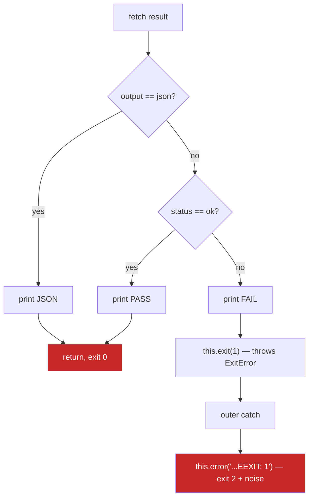
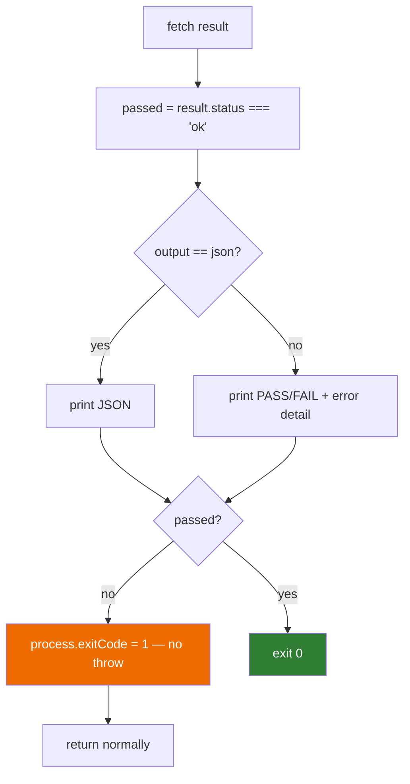

# fix: JSON-mode exit code and empty-list parity across test runner commands

## Summary

`xano workflow_test run -o json` exits 0 on a failing test, and `xano workflow_test run_all -o json` prints the bare string `No workflow tests found` on an empty branch. Both are cases where the `--output json` path skips logic that the summary path performs. Investigation shows both defects are present in **all six `run` commands and all six `run_all` commands** across four surfaces (`unit_test`, `workflow_test`, `tenant/*`, `sandbox/*`) — twelve files, not the two the tickets name.

This plan fixes the whole family, plus a third defect the tickets did not report: in summary mode, `run`'s `this.exit(1)` sits inside a `try` whose `catch` calls `this.error(...)`, so the oclif `ExitError` is swallowed and re-raised — producing exit code **2** (not 1) and a spurious trailing `Failed to run workflow test: EEXIT: 1` line. The same swallow double-wraps genuine API error messages.

The repo already contains the correct pattern: `src/commands/sandbox/unit_test/run/index.ts` and `src/commands/sandbox/workflow_test/run/index.ts` re-throw oclif errors from their catch blocks. The fix propagates that guard to the other four and then makes exit-on-failure output-mode-independent.

---

## Problem Frame

The CLI's test runners are consumed by CI. QA (Nikesh) hit all three defects while building a parallel workflow-test runner on top of the CLI. The failure modes are the dangerous kind — silent:

- **Exit code loss (DEV-7545, High).** Adding `-o json` to get machine-readable output silently disables failure detection. A pipeline goes green over red tests. The JSON body is correct; only the exit code is wrong.
- **Non-JSON output in JSON mode (DEV-7546, Medium).** A branch with no tests is a normal state — freshly created branches routinely have none. `JSON.parse("No workflow tests found")` throws a `SyntaxError`, so the automation crashes rather than reporting "nothing to run".
- **Wrong exit code + noise in summary mode (undocumented).** A failing `run` exits 2 with a misleading `EEXIT: 1` error line appended after the correct `Result: FAIL` output. This is why the ticket recorded "exit=2 ← correct" — 2 was never intended.

Underneath all three is one structural cause: **the JSON branch and the summary branch each own their own control flow**, so behavior that should be output-independent (exit status, empty-case handling) got attached to one branch only.

---

## Requirements

| ID | Requirement | Source |
|----|-------------|--------|
| R1 | A failing `run` exits non-zero regardless of `--output`, matching `run_all` | DEV-7545 |
| R2 | `run` and `run_all` agree on what an exit code means, with the per-test-API-error asymmetry in `run_all` documented rather than hidden (see KTD2) | DEV-7545 |
| R3 | `run_all -o json` emits a valid JSON document when the test list is empty, consistent with that command's populated shape | DEV-7546 |
| R4 | Summary-mode `run` exits 1 (not 2) on failure and prints no spurious error line | Investigation |
| R5 | Genuine API errors are not double-wrapped by the outer catch | Investigation |
| R6 | All four surfaces (`unit_test`, `workflow_test`, `tenant`, `sandbox`) behave identically | User decision (blast radius) |
| R7 | The parity is guarded by a test so it cannot erode by copy-paste | Repo convention |
| R8 | Existing JSON output shapes are preserved — no field renames or additions | Backward compatibility |

**Explicitly out of scope:** normalizing the JSON shape differences *between* commands. `workflow_test run_all` (top-level) emits `total_timing`; its tenant and sandbox siblings do not; `unit_test run_all` emits `obj_name`/`obj_type` and no timing at all. Harmonizing those is a breaking output change and belongs in its own ticket. Each command's empty-case JSON must match **its own** populated shape.

---

## Key Technical Decisions

### KTD1: Use `process.exitCode = 1` in `run`, not `this.exit(1)`

`this.exit(1)` throws an oclif `ExitError`. Inside these commands it is thrown from within a `try` block whose `catch` swallows it. `process.exitCode = 1` sets the code without throwing, so it is immune to the surrounding catch and works identically in both output branches.

This also makes `run` use the **exact same mechanism** `run_all` already uses (`process.exitCode = 1`), which is the most direct way to satisfy R2 — the two commands stop merely agreeing by coincidence and start agreeing by construction.

### KTD2: Failing test = exit 1; CLI/API errors keep oclif's default 2

Per the user decision. A failed assertion and a broken API call are different outcomes and CI should be able to tell them apart. `this.error()` (used for API failures, missing workspace, etc.) continues to produce oclif's standard exit 2. Only test-result failure sets 1.

Note this **changes observed behavior**: a failing summary-mode `run` goes from exit 2 → exit 1. Any CI matching specifically on `2` would need updating; consumers checking "non-zero" are unaffected. This is the intent stated in DEV-7545 and is called out in the README change (U5).

**The 1-vs-2 split is not total, and this plan does not make it total.** In `run_all`, a non-2xx response from an *individual* test's `/run` endpoint is caught by the inner per-test handler and recorded as a failed test result carrying an `API error <status>` message (see `src/commands/workflow_test/run_all/index.ts:163-179`). It therefore flows into `failed` and produces exit **1**, not 2. The same 500 that makes `run` exit 2 makes `run_all` exit 1.

This asymmetry is **deliberate and preserved**: `run_all`'s whole contract is to run every test and report a roll-up, so aborting the batch on one test's transport error would be a worse behavior, and changing it is out of scope for these tickets. Exit 2 in `run_all` is reserved for failures that prevent the batch from running at all — profile resolution, missing workspace, and the *list* call failing. U5 documents this explicitly rather than papering over it, and U3's test scenarios assert it so it stays intentional. Consumers that must distinguish infrastructure failure from assertion failure inspect `results[].message` for the `API error` prefix.

Escalating per-test transport errors to exit 2 is recorded under Deferred to Follow-Up Work.

### KTD3: Adopt the sandbox catch guard everywhere

`src/commands/sandbox/workflow_test/run/index.ts:85` already does:

```
if (error instanceof Error && 'oclif' in error) throw error
```

This is the in-repo pattern for "let oclif's own errors through; only wrap genuinely unexpected ones." Propagate it verbatim to the four `run` commands and four `run_all` commands that lack it. It fixes R5 independent of KTD1, and prevents the class of bug from recurring if someone later reintroduces a `this.error()` or `this.exit()` inside a try.

### KTD4: Check `flags.output` before the empty-list early return

Mirror what `list` already does correctly (`src/commands/workflow_test/list/index.ts:91`) — consult the output flag first, then branch. The empty-case JSON payload is constructed from the same variables as the populated case (`{failed: 0, passed: 0, results: []}`, plus `total_timing: 0` only where the populated shape has it), so the two paths cannot drift.

### KTD5: Test the real exit code by stubbing `globalThis.fetch` — no mocking dependency, no extracted helper

The repo has no HTTP mocking dependency (no sinon, no nock), but it does not need one. `BaseCommand.verboseFetch` bottoms out in a bare `await fetch(url, options)` against the global, so a test can assign `globalThis.fetch`, drive a full command through `@oclif/test`'s `runCommand`, and assert the **actual `process.exitCode`** — which is the thing all three defects are about.

This replaces an earlier idea of extracting `isPassing()` / `emptyRunAllEnvelope()` helpers and unit-testing those. That approach was rejected on two counts: nothing would force the twelve commands to actually call the helpers (so a command could regress inline and every test still pass), and neither helper touches the exit path, so it would not cover the bug being fixed. A predicate spanning both status vocabularies would also be a trap — `run` reads the API's `status: 'ok'` while `run_all` uses an internal `'pass' | 'fail'`.

Static surface assertions in the style of `test/commands/list-paging-surface.test.ts` remain as a cheap second layer, but they guard flag shape, not behavior.

**Test hygiene requirement:** a command under test that sets `process.exitCode = 1` leaks that value into the mocha process and will make `npm test` report failure even when every assertion passes. Each test must save and restore `process.exitCode` (and `globalThis.fetch`) around the invocation.

---

## High-Level Technical Design

Current control flow in `run` — exit and error handling are trapped inside branch-local scope:



Target control flow — verdict is computed once, output is presentation only, exit is set after both branches:



The catch block in both shapes gains the oclif guard, so `this.error()` calls earlier in the `try` propagate their own message and exit code instead of being re-wrapped.

Note the "anything not `ok` is a failure" rule from DEV-7545's impact section: three distinct non-`ok` status values have been observed in the wild (`ok`, `debug`, `exception`). The verdict must be `status === 'ok'`, never an enumeration of known failure values. The existing code already does this correctly in every file — preserve it.

---

## Implementation Units

### U1. Add the oclif error guard to every test-runner catch block

**Goal:** Stop the outer `catch` from swallowing oclif's own `ExitError` and `PrettyPrintableError`, which today converts a clean `this.error(...)` into a double-wrapped message and turns `this.exit(1)` into exit 2.

**Requirements:** R4, R5

**Dependencies:** none

**Note on catch-block count:** each `run_all` file has **two** catch blocks — an inner per-test handler and an outer one — so the family has **18** catch blocks across twelve files, not 12. The sandbox `run_all` files carry the guard in both; the four non-sandbox `run_all` files carry it in neither. Do not fix only the outer catch.

**Files:**
- `src/commands/unit_test/run/index.ts` (catch at ~109)
- `src/commands/workflow_test/run/index.ts` (catch at ~99)
- `src/commands/tenant/unit_test/run/index.ts` (catch at ~111)
- `src/commands/tenant/workflow_test/run/index.ts` (catch at ~102)
- `src/commands/unit_test/run_all/index.ts` (inner ~218, outer ~264)
- `src/commands/workflow_test/run_all/index.ts` (inner ~203, outer ~248)
- `src/commands/tenant/unit_test/run_all/index.ts` (inner ~220, outer ~265)
- `src/commands/tenant/workflow_test/run_all/index.ts` (inner ~201, outer ~244)

**Approach:** Add the guard as the first statement in each catch, matching the sandbox implementation exactly. The two sandbox `run` files and two sandbox `run_all` files already have it in every position — verify and leave unchanged.

Note the inner per-test catch has a different job from the outer one: it converts an unexpected throw into a recorded *failed test result* so the batch continues. The guard still belongs there — an oclif error raised inside that scope (e.g. from a nested `this.error()`) should abort rather than be silently recorded as a test failure with a mangled message.

**Patterns to follow:** `src/commands/sandbox/workflow_test/run/index.ts:85` and `src/commands/sandbox/unit_test/run/index.ts:87`. Copy the guard verbatim so all twelve files read identically.

**Test scenarios:**
- Happy path: a command whose API call returns 500 surfaces the API's own error message once, not prefixed with `Failed to run ... test:`.
- Error path: a genuine unexpected throw (e.g. a network `TypeError`) still gets wrapped with the `Failed to run ... test:` prefix, so unexpected failures remain attributable.
- Edge case: a thrown non-`Error` value (string, object) still hits the `String(error)` branch and does not crash the guard.
- Edge case: in `run_all`, an unexpected non-oclif throw inside the per-test scope is still recorded as a failed test and the batch continues — the guard must not convert ordinary per-test failures into aborts.
- Covered by U4's static guard test asserting all 18 catch blocks contain the oclif re-throw.

**Verification:** `grep -c 'catch (error)'` across the twelve files totals 18, and each occurrence has an oclif re-throw as its first statement. A failing API call prints one error line, not two nested ones.

---

### U2. Make `run` set the failure exit code in both output modes

**Goal:** A failing test exits 1 whether or not `-o json` is passed. This is the DEV-7545 fix.

**Requirements:** R1, R2, R4, R6

**Dependencies:** U1 (the guard must land first; without it, moving the exit call around still risks the catch intercepting it)

**Files:**
- `src/commands/unit_test/run/index.ts`
- `src/commands/workflow_test/run/index.ts`
- `src/commands/tenant/unit_test/run/index.ts`
- `src/commands/tenant/workflow_test/run/index.ts`
- `src/commands/sandbox/unit_test/run/index.ts`
- `src/commands/sandbox/workflow_test/run/index.ts`

**Approach:** Compute the verdict once from the parsed result (`const passed = result.status === 'ok'`) before the output branch. Keep the JSON branch as a pure `JSON.stringify(result, null, 2)` passthrough (R8 — do not reshape the payload). Keep the summary branch's existing PASS/FAIL and per-expectation error rendering unchanged. After both branches, set `process.exitCode = 1` when `!passed`, replacing the `this.exit(1)` currently nested in the summary branch.

Preserve each command's existing summary formatting differences — `unit_test/run` prints `Result: PASS` with no timing and iterates `result.results` for failed expectations; `workflow_test/run` (top-level) prints `(N.NNNs)` via `.toFixed(3)`; tenant and sandbox workflow variants print raw `${result.timing}s` guarded on `timing` being present.

**One formatting exception — guard `timing` in top-level `workflow_test/run`.** That file declares `timing: number` as required and calls `result.timing.toFixed(3)` *before* the status check, while its tenant and sandbox siblings declare `timing?: number` and guard it. That divergence is evidence the field can be absent. If it is absent on a failing result, `.toFixed` throws a `TypeError` into the outer catch and the command exits **2** — defeating this unit's entire purpose on the exact command DEV-7545 filed. Change the local `RunResult` interface to `timing?: number` and render defensively, matching the sibling guard. This is the one place U2 touches formatting, and it is a correctness fix, not a cosmetic one.

**Patterns to follow:** `src/commands/workflow_test/run_all/index.ts:245-247` — the `if (failed > 0) process.exitCode = 1` idiom this unit adopts.

**Test scenarios:**
- Happy path: `status: "ok"`, `-o json` → JSON body printed unchanged, exit code 0.
- Happy path: `status: "ok"`, summary → `Result: PASS`, exit code 0.
- Failure: `status: "exception"`, `-o json` → JSON body printed unchanged (verdict and message still present), exit code 1. This is the DEV-7545 regression case.
- Failure: `status: "debug"`, `-o json` → exit code 1. Confirms "anything not `ok`" rather than an enumeration of known failure strings.
- Failure: `status: "exception"`, summary → `Result: FAIL` plus `Error: <message>`, exit code **1** (previously 2), and no trailing `Failed to run ... EEXIT: 1` line.
- Edge case: `status: "exception"` with no `message` field → summary prints `Result: FAIL` with no error line and still exits 1.
- Edge case: `unit_test run` failing with an empty or absent `results` array → exits 1 without throwing on the `?.filter` path.
- Edge case: `workflow_test run` (top-level) with `status: "exception"` and **no `timing` field** → summary prints `Result: FAIL` with no timing suffix and exits 1, not 2. This is the regression the formatting guard above prevents.
- Error path: HTTP 500 from the run endpoint → exit code 2 (oclif error), not 1. Confirms KTD2's separation of test failure from CLI error for `run` specifically.

**Verification:** For each of the six commands, a failing test exits 1 in both output modes and a passing test exits 0 in both. A 500 response exits 2.

---

### U3. Emit valid JSON from the empty-test-list path in `run_all`

**Goal:** `run_all -o json` on a branch with no tests emits a parseable JSON document matching that command's populated shape. This is the DEV-7546 fix.

**Requirements:** R3, R6, R8

**Dependencies:** none (independent of U1/U2; may land in parallel)

**Files:**
- `src/commands/unit_test/run_all/index.ts` (early return at ~136)
- `src/commands/workflow_test/run_all/index.ts` (early return at ~124)
- `src/commands/tenant/unit_test/run_all/index.ts` (early return at ~141)
- `src/commands/tenant/workflow_test/run_all/index.ts` (early return at ~128)
- `src/commands/sandbox/unit_test/run_all/index.ts` (early return at ~120)
- `src/commands/sandbox/workflow_test/run_all/index.ts` (early return at ~111)

**Approach:** **Keep the `if (tests.length === 0)` early return where it is** and branch on `flags.output` *inside* it — JSON mode emits the zero-valued envelope, summary mode keeps printing `No unit tests found` / `No workflow tests found` verbatim, then `return`. Exit code stays 0 — an empty suite is success, not failure.

Do **not** delete the early return and let the empty case fall through the normal emit path. `mapWithConcurrency([], ...)` is safe on empty input, but the surrounding log lines are unconditional: summary mode would print `Running 0 workflow tests...` followed by `Results: 0 passed, 0 failed (0.000s total)` and the `No ... tests found` line would disappear from all six commands — a silent summary-output change that violates this plan's own Non-Goals.

**Per-command empty payloads must match each command's own populated shape (R8):**

| Command | Empty-case JSON |
|---------|-----------------|
| `workflow_test run_all` (top-level) | `{"failed": 0, "passed": 0, "results": [], "total_timing": 0}` |
| `unit_test run_all` (all three surfaces) | `{"failed": 0, "passed": 0, "results": []}` |
| `tenant/workflow_test run_all` | `{"failed": 0, "passed": 0, "results": []}` |
| `sandbox/workflow_test run_all` | `{"failed": 0, "passed": 0, "results": []}` |

Only the top-level `workflow_test run_all` carries `total_timing` in its populated output, so only it carries it here. Do not add the field to the others — that is the deliberately deferred shape-normalization work.

The empty-case envelope is necessarily a second literal, and a second literal can drift from the populated shape the next time a field is added. Guard that with U4's key-set parity assertion (empty-case keys must equal populated-case keys per command) rather than by restructuring the control flow.

**Patterns to follow:** `src/commands/workflow_test/list/index.ts:91-96` — output flag checked first, empty handled inside the summary branch only.

**Test scenarios:**
- Happy path: empty list, `-o json` → output is valid JSON (`JSON.parse` succeeds) with `passed: 0`, `failed: 0`, `results: []`, exit code 0.
- Happy path: empty list, summary → unchanged `No workflow tests found` / `No unit tests found` text, exit code 0.
- Shape parity: for each command, the key set of the empty-case JSON equals the key set of its populated-case JSON. This is the assertion that catches `total_timing` drift.
- Edge case: `workflow_test run_all -o json` empty case includes `total_timing: 0`; the tenant and sandbox variants do **not** include the key at all.
- Edge case: a non-empty list still produces its existing output unchanged in both modes — confirms the restructure did not alter the populated path.
- Integration: `run_all` with one failing test still sets exit 1 (the empty-path change must not disturb the `failed > 0` exit logic).
- Contract assertion (KTD2): a non-2xx from an individual test's `/run` endpoint is recorded as a failed test with an `API error <status>` message and the command exits **1**, not 2. This locks in the documented `run`/`run_all` asymmetry so it stays deliberate rather than drifting.
- Contract assertion (KTD2): a non-2xx from the *list* call still exits 2 — the batch never started, so it is a CLI error, not a test failure.

**Verification:** `xano workflow_test run_all -w <ws> -b <empty-branch> -o json | jq .` succeeds on every one of the six commands and returns zero counts.

---

### U4. Add a cross-command parity guard test

**Goal:** Prevent the twelve commands from drifting apart again. All three defects in this plan reached production because behavior was copy-pasted into a sibling command without the fix, or fixed in one surface (sandbox) and not the others.

**Requirements:** R7

**Dependencies:** U1, U2, U3

**Files:**
- `test/commands/test-runner-exit-parity.test.ts` (new)

**Approach:** Three layers, ordered by how directly they cover the defects. No new production module and no new dev dependency.

1. **Behavioral tests against the real exit code (primary).** `BaseCommand.verboseFetch` ends in a bare `await fetch(url, options)` against the global, so a test can assign `globalThis.fetch` to a stub, invoke the command through `@oclif/test`'s `runCommand`, and assert on the actual `process.exitCode` and on `JSON.parse(stdout)`. This is the only layer that covers the bugs themselves. Drive each of the twelve commands through the cases in the scenarios below, table-driven so adding a surface later is one row.

   **Required hygiene:** save and restore both `globalThis.fetch` and `process.exitCode` around every invocation in `beforeEach`/`afterEach`. A command that sets `process.exitCode = 1` leaks it into the mocha process and makes `npm test` report failure even when every assertion passed — a confusing trap that will otherwise cost someone an afternoon.

2. **Static surface assertions (cheap regression net).** Import the twelve command classes and assert flag-shape invariants **that are actually true today** — see the scenarios below for the correct per-tier form. Do not assert that a `run`/`run_all` pair agrees on workspace/branch flags: no pair does, because `run` has no `branch` flag on any surface. Record that as an intentional gap in the header comment, not a test.

3. **Source-level guard scan.** Read each of the twelve command files and assert every catch block contains the oclif re-throw and that no `run`/`run_all` body contains a bare `this.exit(`. This is the layer that catches a copy-paste regression in a file nobody thought to add a behavioral case for.

**Patterns to follow:** `test/commands/list-paging-surface.test.ts` — bulk class imports, table-driven `describe` blocks, and a header comment explaining what decision each assertion encodes. Carry that header-comment convention over; each assertion here encodes a decision from this plan's KTDs.

**Test scenarios:**

*Behavioral (per command, table-driven):*
- Failing test (`status: "exception"`), `-o json` → `process.exitCode === 1` and `JSON.parse(stdout)` succeeds. The DEV-7545 regression case.
- Failing test, summary → `process.exitCode === 1` (not 2), stdout contains `Result: FAIL`, and stdout does **not** contain `EEXIT`.
- Passing test (`status: "ok"`), both modes → `process.exitCode` unset or 0.
- Non-`ok`, non-`exception` status (`"debug"`) → exits 1. Confirms "anything not `ok`", not an enumeration.
- Failing `workflow_test run` with `timing` absent → exits 1, does not throw.
- Empty list, `run_all -o json` → `JSON.parse(stdout)` succeeds, zero counts, exit 0. The DEV-7546 regression case.
- Empty list, `run_all` summary → `No ... tests found`, exit 0.
- `run` against a 500 → exit 2.
- `run_all` where one test's `/run` returns 500 → exit 1 with `API error 500` in that result's message (KTD2's documented asymmetry).

*Static surface:*
- All six `run` commands expose `output` with options `['summary', 'json']` and default `'summary'`.
- All six `run_all` commands expose `output`, `concurrency` (default 1), and `branch`.
- Empty-case and populated-case JSON key sets match per command — the assertion that catches `total_timing` drift between the two U3 code paths.

*Source scan:*
- All 18 catch blocks across the twelve files contain the oclif re-throw guard.
- No `run` or `run_all` body contains a bare `this.exit(`.

**Verification:** `npm test` passes. Deliberately reverting any single file's U1/U2/U3 change causes a named test to fail with a message that identifies which command drifted — and because layer 1 asserts real exit codes, this holds for the behavioral fixes, not just the structural ones.

---

### U5. Document the exit-code and JSON output contract

**Goal:** The exit-code behavior these commands now guarantee is currently undocumented — `grep -in exit README.md` returns exactly one hit, and it is about `function run`. CI authors have nothing to write their pipelines against.

**Requirements:** R2, R8, and the project rule that README is the source of truth for users

**Dependencies:** U1, U2, U3 (document what actually ships)

**Files:**
- `README.md` (test-runner sections around lines 440-490)

**Approach:** Add a short exit-code contract covering all four surfaces:

- `0` — all tests passed, or there were no tests to run
- `1` — at least one test failed
- `2` — the command could not run the tests at all (bad workspace, auth failure, unreadable profile, or the list call failing)

State that this holds identically for `-o json` and summary output.

**Document the one asymmetry rather than overstating parity (KTD2).** `run` and `run_all` agree that 1 means test failure and 2 means the command could not run — but they classify a per-test transport error differently. In `run`, a non-2xx from the run endpoint is a CLI error and exits 2. In `run_all`, a non-2xx from an *individual* test's run endpoint is recorded as a failed test result carrying an `API error <status>` message and contributes to exit 1, because `run_all`'s job is to complete the batch and report a roll-up. Consumers that need to tell a backend outage apart from a genuine assertion failure must inspect `results[].message` for the `API error` prefix — the exit code alone will not distinguish them. Say this plainly; a README that claims clean 1-vs-2 separation would send CI authors to open bug tickets against healthy tests during an outage.

Document the empty-case JSON envelope for `run_all -o json`, and note that consumers should treat any `status` other than `"ok"` as failure rather than enumerating known failure values — DEV-7545 records three distinct non-`ok` values seen in the wild.

Call out the behavior change explicitly: a failing summary-mode `run` previously exited 2 and now exits 1. Anyone matching on `2` specifically should switch to a non-zero check.

**Test scenarios:** `Test expectation: none -- documentation only, no behavioral change.`

**Verification:** README documents exit codes 0/1/2 for `unit_test`/`workflow_test` `run` and `run_all` on all four surfaces, and the documented values match what U2 and U3 actually produce.

---

## Risks & Dependencies

| Risk | Likelihood | Impact | Mitigation |
|------|-----------|--------|------------|
| CI somewhere matches on exit code `2` for a failing summary-mode `run` and silently starts passing | Low | High | Documented prominently in U5 as a behavior change. The prior value was accidental, not designed, and non-zero checks (the common case) are unaffected. Worth a heads-up to QA since they built tooling against the current behavior. |
| U3's change accidentally alters populated-case output | Low | Medium | U3 keeps the early return in place rather than restructuring control flow, and its scenarios assert the non-empty path is unchanged; the shape-parity assertion compares empty and populated key sets. |
| `process.exitCode` gets overwritten by oclif's own shutdown path | Low | High | **Verified against `@oclif/core` 4.10.3:** `execute()` resolves `main.run()` then calls `flush()` and never calls `process.exit` on the success path; `handle()` is only reached on throw. `run_all` already relies on this in production. If it ever fails, the fallback is a `this.exit()` outside catch scope, which `handle()` honors via `err.oclif.exit`. |
| A leaked `process.exitCode` from a command under test makes `npm test` fail with all assertions green | Medium | Medium | U4 requires save/restore of `process.exitCode` and `globalThis.fetch` in `beforeEach`/`afterEach`. Called out explicitly because the symptom (green assertions, red suite) is confusing enough to burn real time. |
| An implementer adds the guard to only the outer catch in `run_all` and misses the inner one | Medium | Medium | U1 lists both catch line numbers per file and states the 18-vs-12 count up front; U4's source scan asserts all 18. |
| Shape divergence between `workflow_test run_all` variants (`total_timing`) confuses implementers into "fixing" it | Medium | Medium | Called out as explicitly out of scope in Requirements and again in U3's payload table. |

**Prerequisite:** none. All changes are local to this repo and require no API or backend change.

---

## Scope Boundaries

**In scope:** the three defects above, across all twelve `run`/`run_all` command files on all four surfaces; a parity guard test; README exit-code documentation.

### Deferred to Follow-Up Work

- **Normalizing JSON output shapes across commands.** `workflow_test run_all` (top-level) emits `total_timing`; its tenant and sandbox siblings do not. `unit_test run_all` emits `obj_name`/`obj_type` per result and no timing at all. Top-level `workflow_test` results have a required `timing`; tenant and sandbox have it optional and omit it on error paths, producing heterogeneous `results[]` arrays. Unifying these is a breaking output change that deserves its own ticket and its own consumer heads-up.
- **`function run`'s exit-code behavior** (`src/commands/function/run/index.ts:165` uses `this.exit(1)`). It is the one other command with a documented non-zero exit contract and may have the same catch-swallow issue, but it is a different command family and was not reported.
- **Escalating `run_all`'s per-test transport errors to exit 2.** Today a non-2xx from an individual test's run endpoint becomes a failed test result and contributes to exit 1 (see KTD2). Making that exit 2 would give `run` and `run_all` literal exit-code parity, but it changes batch semantics — one flaky transport error would abort or reclassify a whole suite — and it is beyond what DEV-7545 asked for. This plan documents the asymmetry instead of changing it.

### Non-Goals

- Changing the `run`/`run_all` summary output text or formatting.
- Changing the JSON payload shape of the populated case for any command.
- Adding an HTTP mocking dependency to the test suite.

---

## Open Questions

- **Should QA be notified of the exit 2 → 1 change before merge?** Nikesh built a parallel workflow-test runner against the current behavior and DEV-7545's impact section notes they are already working around this by parsing `status` instead of trusting the exit code — so they are likely unaffected. Worth a comment on the ticket regardless. Resolve during PR review, not before implementation.

---

## Sources & Research

- DEV-7545 — `workflow_test run -o json` exits 0 when the test fails (High, In Progress)
- DEV-7546 — `workflow_test run_all -o json` prints plain text on a branch with no tests (Medium, In Progress)
- QA-8242 — Xanomatic: CLI workflow test JSON output mishandles failures and empty branches (parent QA report)
- In-repo pattern for the catch guard: `src/commands/sandbox/workflow_test/run/index.ts:85`, `src/commands/sandbox/unit_test/run/index.ts:87`
- In-repo pattern for output-flag-first branching: `src/commands/workflow_test/list/index.ts:91-96`
- In-repo pattern for cross-command guard tests: `test/commands/list-paging-surface.test.ts`

No external research was performed. The correct implementation pattern for every defect in this plan already exists elsewhere in this codebase.
